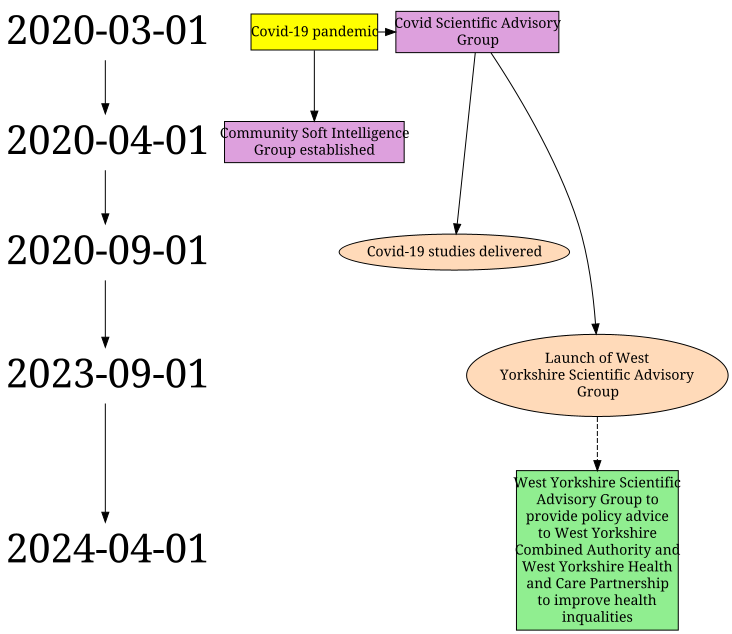

# RippleFX

A desktop tool for generating **temporal graph visualisations** from CSV data. It parses node and relationship files, produces [Graphviz](https://graphviz.org/) DOT files, and renders them as PNG images — with events aligned to a chronological timeline spine.

### Read the paper here
Padgett, Louise, Philip Garnett, Maria Bryant, Laura Nixon, Patience Gansallo, Amy Creaser, Bridget Lockyer, Jessica Sheringham, and Liina Mansukoski. 2026. [“Creating a Meta-REM Map: Pragmatic Improvements to Ripple Effects Mapping Methodology Used to Support Evaluations of Complex Public Health Systems.”](http://dx.doi.org/10.1186/s12874-026-02811-6) BMC Medical Research Methodology 26 (1): 74.
### Example output


---

## What it does

RippleFX takes two CSV files — one describing **nodes** (people, organisations, events) and one describing **relationships** between them — and produces a directed graph where nodes are ranked against a timeline of dates. This makes it easy to visualise how entities and events connect and evolve over time.

It was built for analysing organisational and institutional networks, but the underlying approach works for any domain where temporal relationships matter.

---

## Features

- Parses node and relationship CSV files
- Automatically extracts dates and builds a chronological timeline spine
- Supports node shapes, fill colours, and custom attributes via CSV columns
- Supports edge styles (dashed, solid, arrowheads) via CSV columns
- Three output modes:
  - **Create DOT** — writes the `.dot` file only
  - **Create DOT & PNG** — writes `.dot` then renders via the external `dot` command
  - **Render Image** — writes `.dot` then renders entirely within Java (no external tool needed) and displays the result in a viewer
- Simple GUI — no command-line arguments required
- Produces a null-check file listing any relationship references to missing nodes

---

## Requirements

- Java 21 or later
- Maven 3.x (for building from source)
- [Graphviz](https://graphviz.org/download/) installed on your PATH — **only needed for the "Create DOT & PNG" option**. The "Render Image" button works without it.

---

## Building from source

```bash
git clone https://github.com/YOUR_USERNAME/RippleFX.git
cd RippleFX
mvn package
```

This produces a self-contained fat JAR in `target/`:

```
target/RippleFX-1.0-SNAPSHOT-jar-with-dependencies.jar
```

---

## Running

**From the terminal:**
```bash
java -jar target/RippleFX-1.0-SNAPSHOT-jar-with-dependencies.jar
```

**On Windows** — if Java is installed, double-clicking the JAR file should launch the GUI directly.

**Creating a native installer** (optional, requires JDK 21):
```bash
jpackage \
  --input target \
  --main-jar RippleFX-1.0-SNAPSHOT-jar-with-dependencies.jar \
  --main-class net.prgarnett.AppGui \
  --name RippleFX \
  --app-version 1.0 \
  --type app-image
```
This bundles a JRE so end users do not need Java installed.

---

## CSV format

### Nodes file

| Column | Description |
|---|---|
| `type` | Graphviz node shape — `box`, `ellipse`, `diamond`, etc. |
| `attribute_label_1` | Attribute name — use `name` for the node label, `date` for timeline placement |
| `value_1` | Attribute value |
| `attribute_label_2` | Additional attribute name (e.g. `fillcolor`, `style`) |
| `value_2` | Additional attribute value |
| … | Further attribute/value pairs as needed |

Dates should be in `dd/MM/yyyy` format. Any attribute matching a known Graphviz node attribute (`fillcolor`, `shape`, `style`, etc.) is written directly to the DOT file; unknown attributes are collected into a tooltip.

### Relationships file

| Column | Description |
|---|---|
| `match id 1` | Label of the source node (must match a `name` value in the nodes file) |
| `match id 2` | Label of the target node |
| `attribute_label_1` | Edge attribute name (e.g. `style`, `color`, `label`) |
| `value_1` | Edge attribute value |
| … | Further attribute/value pairs as needed |

---

## Project structure

```
RippleFX/
├── src/main/java/net/prgarnett/
│   ├── App.java            # Original CLI entry point (retained)
│   ├── AppGui.java         # GUI entry point
│   ├── DotMakeNodes.java   # Core CSV parsing and DOT generation
│   └── JavaRenderer.java   # Java-native PNG rendering (graphviz-java / V8)
├── pom.xml
└── README.md
```

---

## Dependencies

| Library | Purpose |
|---|---|
| [Apache Commons CSV](https://commons.apache.org/proper/commons-csv/) | CSV parsing |
| [graphviz-java-all-j2v8](https://github.com/nidi3/graphviz-java) | Java-native DOT rendering via embedded V8 engine |

---

## Licence

MIT — see [LICENSE](LICENSE)

---

## Author

Philip Garnett — [github.com/prgarnett](https://github.com/prgarnett)
